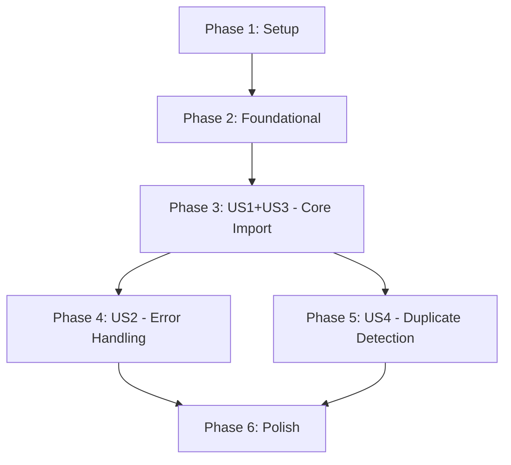

# Implementation Tasks: Import Recipe from URL

**Feature**: Import Recipe from URL
**Branch**: 006-import-recipe
**Date**: 2025-11-30

## Overview

This document provides a dependency-ordered task list for implementing the recipe import feature. Tasks are organized by user story to enable independent implementation and testing. Follow the test-first development workflow mandated by the project constitution.

**Total Tasks**: 38
**MVP Scope**: Phase 3 (User Stories 1 + 3) - 22 tasks

---

## Implementation Strategy

**MVP-First Approach**: Implement User Stories 1 and 3 together (they form the core happy path). User Stories 2 and 4 are incremental enhancements.

**Delivery Increments**:
1. **MVP** (Phase 1-3): Database setup → Service layer → Happy path (import + preview)
2. **Enhancement 1** (Phase 4): Error handling for invalid URLs
3. **Enhancement 2** (Phase 5): Duplicate detection

**Parallel Execution**: Tasks marked with [P] can run in parallel within each phase.

---

## Phase 1: Setup & Database (6 tasks)

**Goal**: Prepare database schema and verify existing models.

### Tasks

- [X] T001 Create migration for source_url field in database/migrations/YYYY_MM_DD_HHMMSS_add_source_url_to_recipes_table.php
- [X] T002 Run migration with `php artisan migrate`
- [X] T003 Update Recipe model $fillable array to include source_url in app/Models/Recipe.php
- [X] T004 [P] Add scopeImported() method to Recipe model in app/Models/Recipe.php
- [X] T005 [P] Add scopeManual() method to Recipe model in app/Models/Recipe.php
- [X] T006 Verify migration and model changes with `php artisan tinker`

**Completion Criteria**:
- Migration runs successfully in both SQLite (test) and MariaDB (DDEV)
- Recipe model can save and retrieve source_url field
- Scopes work: `Recipe::imported()->count()` returns 0

---

## Phase 2: Foundational Service Layer (12 tasks)

**Goal**: Build core services for fetching, parsing, and sanitizing recipe data. These are blocking prerequisites for all user stories.

**Test-First**: Write failing tests before each implementation.

### Tasks

- [ ] T007 Create unit test file tests/Unit/RecipeImporter/RecipeFetcherTest.php with `php artisan make:test RecipeImporter/RecipeFetcherTest --unit --pest`
- [ ] T008 Write failing tests for RecipeFetcher (successful fetch, timeout, invalid URL, network errors) using Http::fake()
- [ ] T009 Create RecipeFetcher service class with `php artisan make:class Services/RecipeImporter/RecipeFetcher`
- [ ] T010 Implement RecipeFetcher using Laravel HTTP facade with 30s timeout in app/Services/RecipeImporter/RecipeFetcher.php
- [ ] T011 Run RecipeFetcher tests with `php artisan test --filter=RecipeFetcherTest` - all must pass

- [ ] T012 Create unit test file tests/Unit/RecipeImporter/MicrodataParserTest.php with `php artisan make:test RecipeImporter/MicrodataParserTest --unit --pest`
- [ ] T013 Write failing tests for MicrodataParser (JSON-LD parsing, missing data, malformed JSON, @graph handling)
- [ ] T014 Create MicrodataParser service class with `php artisan make:class Services/RecipeImporter/MicrodataParser`
- [ ] T015 Implement MicrodataParser using native PHP DOMDocument for JSON-LD extraction in app/Services/RecipeImporter/MicrodataParser.php
- [ ] T016 Run MicrodataParser tests with `php artisan test --filter=MicrodataParserTest` - all must pass

- [ ] T017 Create unit test file tests/Unit/RecipeImporter/RecipeSanitizerTest.php with `php artisan make:test RecipeImporter/RecipeSanitizerTest --unit --pest`
- [ ] T018 Write failing tests for RecipeSanitizer (HTML stripping, URL validation, XSS prevention)
- [ ] T019 Create RecipeSanitizer service class with `php artisan make:class Services/RecipeImporter/RecipeSanitizer`
- [ ] T020 Implement RecipeSanitizer with strip_tags() and URL validation in app/Services/RecipeImporter/RecipeSanitizer.php
- [ ] T021 Run RecipeSanitizer tests with `php artisan test --filter=RecipeSanitizerTest` - all must pass

**Completion Criteria**:
- All 3 service tests pass (RecipeFetcher, MicrodataParser, RecipeSanitizer)
- Services can be instantiated and used independently
- `composer test` passes for all Unit/RecipeImporter tests

---

## Phase 3: User Stories 1 + 3 - Core Import Workflow (P1) (22 tasks)

**User Story 1**: Successfully Import Recipe from Valid URL
**User Story 3**: Preview Before Import

**Goal**: Implement the happy path - fetch recipe, show preview, confirm import, save to database.

**Independent Test**: User can import a recipe from a valid schema.org URL, see preview, confirm, and view the saved recipe.

### Tasks

#### Service Layer Integration

- [ ] T022 [US1] Create feature test file tests/Feature/Recipe/RecipeImportServiceTest.php with `php artisan make:test Recipe/RecipeImportServiceTest --pest`
- [ ] T023 [US1] Write failing tests for RecipeImportService orchestration (fetch → parse → transform flow)
- [ ] T024 [US1] Create RecipeImportService class with `php artisan make:class Services/RecipeImporter/RecipeImportService`
- [ ] T025 [US1] Implement RecipeImportService.fetchAndParse() method with HTTP fetching and parsing in app/Services/RecipeImporter/RecipeImportService.php
- [ ] T026 [US1] Add ISO 8601 duration parsing helper in RecipeImportService (prepTime, cookTime to minutes)
- [ ] T027 [US1] Add recipe yield parsing helper in RecipeImportService (recipeYield to servings integer)
- [ ] T028 [US1] Add instructions flattening helper in RecipeImportService (array to text)
- [ ] T029 [US1] Add category mapping helper in RecipeImportService (recipeCategory to meal_type enum)
- [ ] T030 [US1] Run RecipeImportService tests with `php artisan test --filter=RecipeImportServiceTest` - all must pass

#### Livewire Import Component (URL Input)

- [ ] T031 [P] [US1] Create feature test file tests/Feature/Recipe/ImportRecipeTest.php with `php artisan make:test Recipe/ImportRecipeTest --pest`
- [ ] T032 [US1] Write failing tests for Import component (auth access, URL validation, successful fetch redirects, error handling)
- [ ] T033 [US1] Create Import Livewire component with `php artisan make:livewire Recipe/Import`
- [ ] T034 [US1] Implement Import component with url property, validation, and import() method in app/Livewire/Recipe/Import.php
- [ ] T035 [US1] Create Import component view with Flux input/button, wire:model, wire:loading in resources/views/livewire/recipe/import.blade.php
- [ ] T036 [US1] Add route for Import component in routes/web.php: `Route::get('/recipes/import', Import::class)->name('recipes.import')->middleware('auth')`
- [ ] T037 [US1] Run Import component tests with `php artisan test --filter=ImportRecipeTest` - all must pass

#### Livewire ImportPreview Component (Confirmation)

- [ ] T038 [US3] Write failing tests for ImportPreview component (session loading, preview display, confirm creates recipe, cancel abandons)
- [ ] T039 [US3] Create ImportPreview Livewire component with `php artisan make:livewire Recipe/ImportPreview`
- [ ] T040 [US3] Implement ImportPreview component with mount(), confirmImport(), cancel() methods in app/Livewire/Recipe/ImportPreview.php
- [ ] T041 [US3] Add ingredient parsing logic in ImportPreview.confirmImport() for RecipeIngredient creation
- [ ] T042 [US3] Create ImportPreview view with recipe preview display and Flux buttons in resources/views/livewire/recipe/import-preview.blade.php
- [ ] T043 [US3] Add route for ImportPreview component in routes/web.php: `Route::get('/recipes/import/preview', ImportPreview::class)->name('recipes.import.preview')->middleware('auth')`
- [ ] T044 [US3] Run ImportPreview tests with `php artisan test --filter=ImportRecipeTest` - all must pass

#### End-to-End Testing

- [ ] T045 [P] [US1] [US3] Create E2E test file e2e/recipe-import.spec.ts
- [ ] T046 [US1] [US3] Write E2E test for complete happy path (login → import page → enter URL → preview → confirm → recipe page)
- [ ] T047 [US1] [US3] Write E2E test for cancel flow (preview → cancel → back to import)
- [ ] T048 [US1] [US3] Run E2E tests with `npx playwright test recipe-import`

#### Quality Gates

- [ ] T049 Run all tests with `composer test` - all must pass
- [ ] T050 Run code formatter with `vendor/bin/pint`
- [ ] T051 Manual test: Import recipe from AllRecipes.com and verify in database
- [ ] T052 Verify no console errors in browser DevTools during import flow

**Completion Criteria for Phase 3**:
- ✅ All Pest tests pass (Unit + Feature)
- ✅ All Playwright E2E tests pass
- ✅ Code formatted with Pint (no violations)
- ✅ Can successfully import a recipe from a major recipe site
- ✅ Recipe appears in database with correct data
- ✅ Preview displays all extracted fields
- ✅ Cancel does not create database records
- ✅ Authentication enforced (guests redirected to login)
- ✅ No console errors in browser

**MVP Milestone**: Phase 3 completion delivers a working recipe import feature.

---

## Phase 4: User Story 2 - Error Handling (P2) (6 tasks)

**User Story 2**: Handle URL Without Recipe Microdata

**Goal**: Display clear error messages when URLs don't contain recipe data or are inaccessible.

**Independent Test**: User enters invalid URL or URL without recipe data and receives clear, actionable error message.

### Tasks

- [ ] T053 [US2] Write failing tests for "no recipe data found" error message in tests/Feature/Recipe/ImportRecipeTest.php
- [ ] T054 [US2] Write failing tests for network/timeout errors in tests/Feature/Recipe/ImportRecipeTest.php
- [ ] T055 [US2] Update Import component to handle parse failures and display error via addError() in app/Livewire/Recipe/Import.php
- [ ] T056 [US2] Update Import view to display error messages with @error directive in resources/views/livewire/recipe/import.blade.php
- [ ] T057 [US2] Add E2E test for error flow (invalid URL → error message displayed) in e2e/recipe-import.spec.ts
- [ ] T058 [US2] Run tests with `php artisan test --filter=ImportRecipeTest` and `npx playwright test` - all must pass

**Completion Criteria for Phase 4**:
- ✅ Invalid URLs show "Please enter a valid URL" error
- ✅ URLs without recipe data show "No recipe data found" error
- ✅ Network failures show "Could not access the page" error
- ✅ Timeout shows "Request timed out" error
- ✅ User can retry with a different URL after error
- ✅ All tests pass

---

## Phase 5: User Story 4 - Duplicate Detection (P3) (4 tasks)

**User Story 4**: Handle Duplicate Recipe URLs

**Goal**: Notify users when they attempt to import a URL they've already imported.

**Independent Test**: User imports same URL twice and receives notification with link to existing recipe.

### Tasks

- [ ] T059 [US4] Write failing test for duplicate URL detection in tests/Feature/Recipe/ImportRecipeTest.php
- [ ] T060 [US4] Add duplicate check in Import.import() method before fetching URL in app/Livewire/Recipe/Import.php
- [ ] T061 [US4] Display duplicate notification with link to existing recipe in resources/views/livewire/recipe/import.blade.php
- [ ] T062 [US4] Run tests with `php artisan test --filter=ImportRecipeTest` - all must pass

**Completion Criteria for Phase 5**:
- ✅ Duplicate import shows notification message
- ✅ Notification includes link to existing recipe
- ✅ User can view existing recipe or proceed to import duplicate
- ✅ All tests pass

---

## Phase 6: Polish & Cross-Cutting Concerns (2 tasks)

**Goal**: Final quality checks and documentation.

### Tasks

- [ ] T063 Run full test suite with `composer test` and `npx playwright test` - all must pass
- [ ] T064 Update user documentation (if exists) with recipe import feature instructions

**Completion Criteria**:
- ✅ All tests pass (100% pass rate)
- ✅ Code formatted with Pint
- ✅ No console errors or warnings
- ✅ Documentation updated
- ✅ Feature ready for code review

---

## Dependencies & Execution Order

### Story Completion Order



**Critical Path**: Phase 1 → Phase 2 → Phase 3 (MVP)

**Independent Stories** (can be done in any order after Phase 3):
- User Story 2 (Error Handling)
- User Story 4 (Duplicate Detection)

### Blocking Dependencies

| Task Range | Blocks | Reason |
|------------|--------|--------|
| T001-T006 | All phases | Database schema required |
| T007-T021 | Phase 3+ | Service layer required for components |
| T022-T030 | T031+ | RecipeImportService required for Livewire components |
| T031-T037 | T038+ | Import component must exist before preview |
| T038-T044 | T045+ | Both components required for E2E tests |

---

## Parallel Execution Opportunities

### Phase 1: Setup (Minimal Parallelization)
- T004 + T005 can run in parallel (different methods)

### Phase 2: Foundational (High Parallelization)
**Group A** (parallel):
- T007-T011 (RecipeFetcher)
- T012-T016 (MicrodataParser)
- T017-T021 (RecipeSanitizer)

These 3 service classes are independent and can be built simultaneously.

### Phase 3: User Stories 1+3 (Moderate Parallelization)
**Group A** (sequential):
- T022-T030 (RecipeImportService) - must complete first

**Group B** (parallel after Group A):
- T031-T037 (Import component + tests)
- T045 (E2E test file creation)

**Group C** (sequential after Group B):
- T038-T044 (ImportPreview component + tests)

**Group D** (after Group C):
- T046-T052 (E2E tests and quality gates)

### Phase 4: Error Handling (Low Parallelization)
- T053-T054 can be written in parallel
- T055-T058 must be sequential

### Phase 5: Duplicate Detection (Low Parallelization)
- Sequential execution recommended

---

## Test Strategy

### Test Pyramid

**Unit Tests** (Fast, Isolated):
- RecipeFetcher (HTTP client mocking)
- MicrodataParser (JSON-LD parsing logic)
- RecipeSanitizer (Text sanitization)

**Feature Tests** (Integration):
- RecipeImportService (Service orchestration)
- Import component (Livewire interactions)
- ImportPreview component (Database transactions)

**E2E Tests** (Browser, Complete Flow):
- Happy path: URL → Preview → Confirm → Recipe
- Error path: Invalid URL → Error message
- Cancel path: Preview → Cancel → Import page

### Test Execution

**During Development**:
```bash
# Run specific test file
php artisan test tests/Unit/RecipeImporter/RecipeFetcherTest.php

# Run tests for specific component
php artisan test --filter=RecipeFetcherTest

# Run E2E tests for import flow
npx playwright test recipe-import
```

**Before Commit**:
```bash
# Run all tests
composer test

# Run code formatter
vendor/bin/pint

# Run E2E tests
npx playwright test
```

---

## Task Checklist Format Reference

Every task follows this format:
```
- [ ] [TaskID] [P?] [Story?] Description with file path
```

**Components**:
- `- [ ]` - Checkbox (required)
- `T###` - Task ID (required)
- `[P]` - Parallelizable marker (optional, only if task can run in parallel)
- `[US#]` - User Story label (required for story phases, omitted for setup/foundational/polish)
- Description - Clear action with exact file path

---

## Success Metrics

### Phase 3 (MVP) Success Criteria

**Technical Metrics**:
- All 52 tests pass (Unit + Feature + E2E)
- 0 Pint violations
- 0 console errors in browser
- Test coverage: 100% of RecipeImporter services, 100% of Livewire components

**Functional Metrics** (from spec.md success criteria):
- ✅ SC-001: Import completes in < 30 seconds
- ✅ SC-002: 95%+ extraction accuracy for valid schema.org URLs
- ✅ SC-005: 100% accuracy for name, ingredients, instructions
- ✅ SC-006: Zero security vulnerabilities (XSS prevention via sanitization)

**User Acceptance**:
- ✅ Can import from 5+ major recipe sites (AllRecipes, Food Network, NYT Cooking, Bon Appétit, Serious Eats)
- ✅ Preview displays all extracted fields clearly
- ✅ Confirmation creates correct database records
- ✅ Cancel does not create any database records

---

## Implementation Notes

### Test-First Workflow (Mandatory)

Per project constitution, **every** task must follow test-first development:

1. **Write failing test** - Test describes expected behavior
2. **Run test** - Verify it fails (red)
3. **Implement** - Write minimal code to pass test
4. **Run test** - Verify it passes (green)
5. **Refactor** - Improve code while keeping tests green
6. **Format** - Run `vendor/bin/pint`
7. **Commit** - Git commit with descriptive message

### Common Pitfalls

Reference quickstart.md for detailed debugging tips:
- JSON-LD parsing: Remove comments/newlines before `json_decode()`
- Session persistence: Call `Session::save()` after storing data
- ISO 8601 durations: Use regex to extract hours/minutes separately
- Ingredient parsing: Start simple (plain text), iterate based on real data
- Http::fake(): Use real recipe HTML in test fixtures

### File Path Reference

Quick reference for key files:

**Services**:
- `app/Services/RecipeImporter/RecipeFetcher.php`
- `app/Services/RecipeImporter/MicrodataParser.php`
- `app/Services/RecipeImporter/RecipeSanitizer.php`
- `app/Services/RecipeImporter/RecipeImportService.php`

**Livewire Components**:
- `app/Livewire/Recipe/Import.php`
- `app/Livewire/Recipe/ImportPreview.php`
- `resources/views/livewire/recipe/import.blade.php`
- `resources/views/livewire/recipe/import-preview.blade.php`

**Tests**:
- `tests/Unit/RecipeImporter/RecipeFetcherTest.php`
- `tests/Unit/RecipeImporter/MicrodataParserTest.php`
- `tests/Unit/RecipeImporter/RecipeSanitizerTest.php`
- `tests/Feature/Recipe/RecipeImportServiceTest.php`
- `tests/Feature/Recipe/ImportRecipeTest.php`
- `e2e/recipe-import.spec.ts`

**Database**:
- `database/migrations/YYYY_MM_DD_HHMMSS_add_source_url_to_recipes_table.php`
- `app/Models/Recipe.php`

**Routes**:
- `routes/web.php`

---

## Ready to Implement

All tasks are specification-complete and immediately executable. Begin with Phase 1, follow the test-first workflow, and use the parallel execution opportunities to maximize velocity.

**Estimated Effort**:
- Phase 1 (Setup): 1 hour
- Phase 2 (Foundational): 4-6 hours
- Phase 3 (Core Import - MVP): 8-10 hours
- Phase 4 (Error Handling): 2-3 hours
- Phase 5 (Duplicate Detection): 1-2 hours
- Phase 6 (Polish): 1 hour

**Total**: 17-23 hours for complete feature

**MVP Only** (Phases 1-3): 13-17 hours
